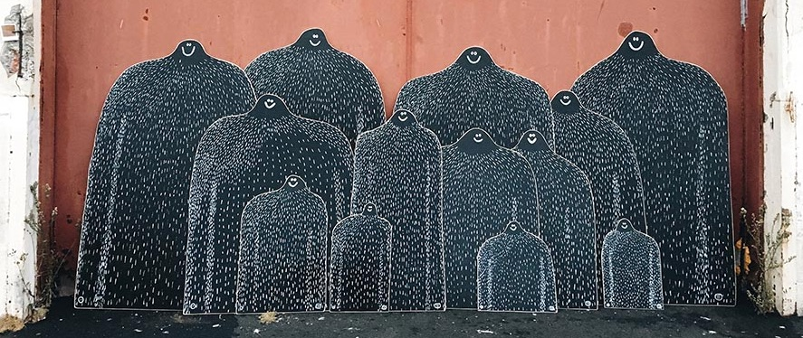

# Lyle Sightings

Tracking Lyle sightings since 2018.



## Todo

 - [x] holding page
 - [x] sightings model
 - [x] management command to import tagged instagrams
 - [x] front-end styling
 - [x] Heroku deployment
   - [x] PostgreSQL
   - [x] S3 for media
   - [x] Google Maps key
   - [x] Schedule for Instagram scraping
 - [x] Cloudflare for SSL & performance
 - [x] Don't fetch duplicate images
 - [ ] Pagination (https://codepen.io/roylodder/pen/bBbdoe)
 - [ ] Show/hide status flag
 - [ ] map view
 - [ ] admin UI to approve / reject new photos
 - [ ] admin UI to override image data, e.g. location information
 - [ ] user whitelisting
 - [ ] apply for Instagram full API

## Developing

`pipenv shell`

Import Lyles:

`./manage.py scrapelyles`

## Deploying

```
pipenv run pip freeze > requirements.txt
heroku container:push web
```

## Notes

 - Instagram oEmbed options: https://www.instagram.com/developer/embedding/
 - Scraper, if necessary: https://github.com/rarcega/instagram-scraper
  - `instagram-scraper lylesighting --tag --media-metadata --latest --media-types=none -d scrapings`
 - Try https://www.geoimgr.com/ for image tagging
 - 